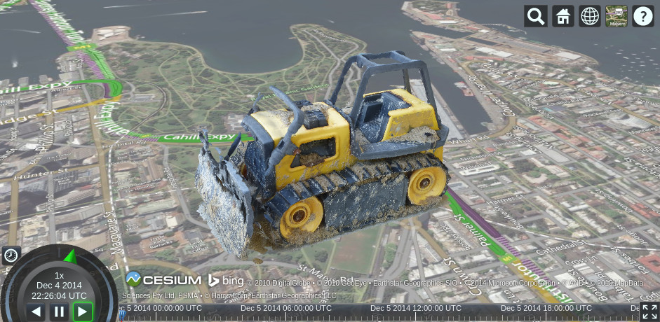
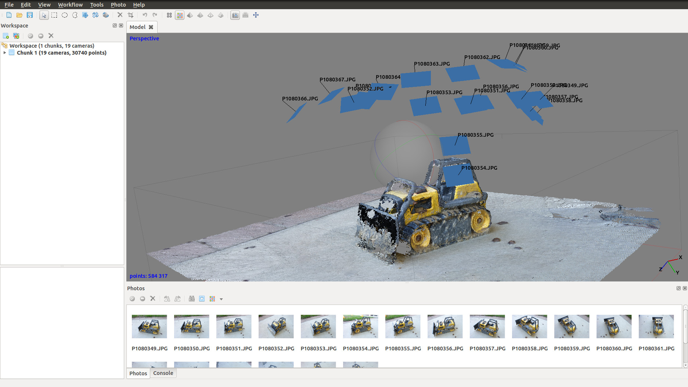

From the real to the virtual world
----------------------------------

A number of [Doarama](http://doarama.com/) users have expressed interest in augmenting the [Cesium WebGL Virtual Globe](http://cesiumjs.org/) with custom meshes.
For example this might include a 3D model generated from photos captured by a drone.
It is now relatively straightforward to capture 3D objects from the real world using photogrammetry.
Provided the 3D model is not too complex, it can be brought directly into Cesium for display.
In the following example we'll proceed from photos taken of a toy bulldozer through to a 3D model visualised in Cesium using glTF.
Note that emphasis is placed on workflow rather than the quality of the 3D model.

View the [live demo](http://nicta.github.io/cesium-simple-photogrammetry/)

Capture
-------

Your photogrammetry software should provide recommendations on how to take photos to provide best results.
In general the technique will work best on non-shiny objects, and you'll want to provide some overlap between the photos you take.

For this test a simple consumer Panasonic Lumix DMC-ZR1 was used.  In this test, the quality of the 3D model reconstruction would have benefited from a greater number of pictures take.

Process
-------

There are a number of photogrammetry software solutions available with different licensing and costs.  Here's some as a starting point...

* [Agisoft PhotoScan](http://www.agisoft.com/)
* [Autodesk RECAP 360](https://recap360.autodesk.com/)
* [Autodesk 123D Catch](http://www.123dapp.com/catch)
* [VisualSFM](http://ccwu.me/vsfm/)
* [openMVG](https://github.com/openMVG/openMVG/)
* [CMVS-PMVS](https://github.com/pmoulon/CMVS-PMVS)
* [OpenDroneMap](https://github.com/OpenDroneMap)
* [MeshLab](http://meshlab.sourceforge.net/) can also be useful for verifying meshes.

For simplicity we'll use a free trial of Agisoft PhotoScan Standard Edition (normally US$179).

The processing in PhotoScan has multiple stages with a few simple options for each stage.  These stages are shown under the 'Workflow' menu.  For the purpose of this test we'll just stick to the defaults options.

* Add photos
* Align photos (this will create a sparse point cloud)
* Build dense point cloud
* Build mesh
* Build texture

The whole process took around 15 mins to generate this model from photos.  Obviously timing will vary depending on the quality and size of the model you require.
Once you have done these steps you can use the File menu to export the model as Collada

Postprocess
-----------

I wasn't able to convert the PhotoScan Collada model directly to glTF due to [an issue with the converter](https://github.com/KhronosGroup/glTF/issues/339).
To work around this I used the OpenCollada maya plugin to import the model, then re-assigned the shader (as a Maya surface shader).  I also trimmed some polygons from the mesh.
The model was then re-exported again with the OpenCollada maya plugin.
Make sure texture paths in the Collada model are relative (e.g. change 'file://path/to/my/file.jpg' to 'file.jpg').

Hopefully as the glTF converter improves this postprocess step will not be required.  If working with Autodesk Maya or 3DS Max I strongly suggest using the OpenCollada plugin, builds of which can be found [here](http://opencollada.fl4re.com/).

Convert
-------

Use the Cesium [online converter](http://cesiumjs.org/convertmodel.html) to convert the model to glTF.
If successful you should see a preview of the model in the window.
Any glTF conversion problems can be reported to [glTF issues](https://github.com/KhronosGroup/glTF/issues).

Load into Cesium
----------------

The final step is to load and geolocate your model.
For this test I've created a [simple CZML](models/bulldozer.czml) for loading into Cesium and have manually geolocated it, paying no attention to accurate scale.
